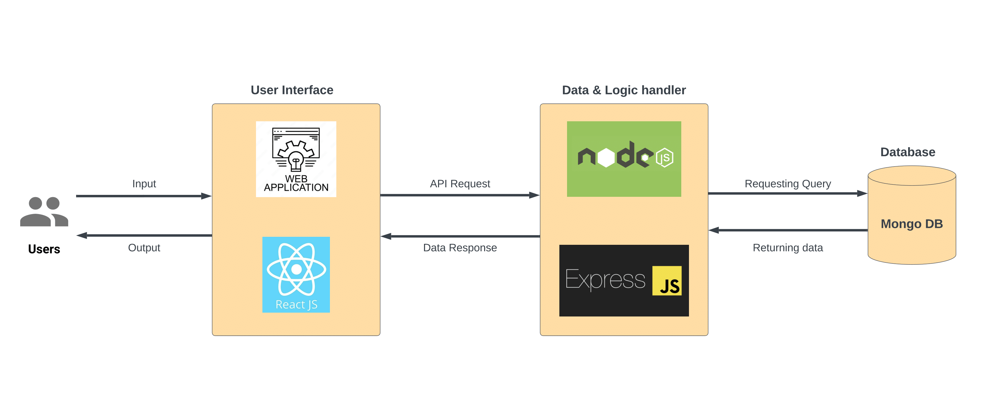

# Worksy
A marketplace tailored for students, where they can offer and seek freelance services, exclusively within their campus community

## Team Members:

| Name             | U of M Email            | GitHub Username |
|------------------|-------------------------|-----------------|
| Tung Nguyen      | nguye49@myumanitoba.ca  | xuaantung       |
| Noel Omeiza      | omeizan@myumanitoba.ca  | omeizan         |
| Casandra Hayward | haywardc@myumanitoba.ca | chayward3113    |
| Evan Murray      | murraye2@myumanitoba.ca | evanmurry99     |
| Diljot Singh     | singhd18@myumanitoba.ca | Dilpunjab       |

## Documentation

[Meeting Minute](https://github.com/evanmurray99/Worksy/wiki/Minutes)

[Project Proposal](https://github.com/evanmurray99/Worksy/wiki/Project-Proposal)

[Testing Plan](./docs/testing-plan.md)

[Coding style and Naming Convention](https://google.github.io/styleguide/jsguide.html)

[Class Architecture](./docs/Class-Architecture.jpeg)

### Vision
In a world where many students face challenges due to limited experience and professional networks, Worksy emerges as an indispensable solution. Worksy is  committed to bridging the gap between students seeking valuable work opportunities and business owners in need of specialized services.

### Summary
Within the Worksy platform, students can showcase their skills and proficiencies, enabling clients to select the best candidate for their needs. Through connections with forward-thinking business owners and entrepreneurs, students not only experience financial growth but also enrich their professional journey. The main feature of our application is the ability to do a robust search, allowing users to easily discover products or services by applying filters and sorting options. Posting on Worksy is crucial for communication between users, providing a platform to create listings, ask questions, negotiate, and leave reviews. Users can personalize their accounts to manage posts, chats, and bookmarks. The chat feature facilitates seamless interaction between students and clients. Lastly, the review system benefits both students and clients; it benefits students by building a positive work history and it benefits clients by establishing trust in their choice of service providers.

### Stakeholders

#### Students and Alumni

Students want to use their skills and knowledge learnt in school to work for people in need of their services. Using our platform they are more likely to be connected with potential client.

#### Business owners
Business owners in need of specific services can easily find well-equipped students through Worksy, making it convenient to address their business needs

#### Entrepreneurs
Entrepreneurs looking for specialized skills to support their ventures can look into Worksy's network of skilled students, helping them achieve their goals more efficiently.

### Core Features
1. Search
2. Post
3. Account Management
4. In-app messaging
5. Review

### Technologies
1. React - framework for user interface
2. Node.js - runtime environment to execute server side code
3. Express.js - backend framework for RESTful APIs
4. MongoDB - database 

### Architecture Diagram

